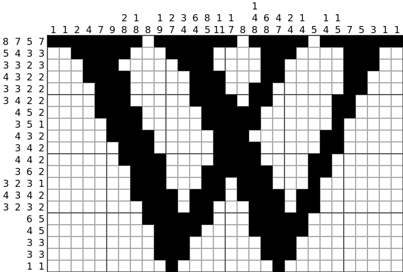

# Nonogram Solver

Nonograms, also known as Paint by Numbers, Picross, Griddlers, Pic-a-Pix, and various other names, are picture logic puzzles in which cells in a grid must be colored or left blank according to numbers at the side of the grid to reveal a hidden picture. In this puzzle type, the numbers are a form of discrete tomography that measures how many unbroken lines of filled-in squares there are in any given row or column. 

For example, a clue of "4 8 3" would mean there are sets of four, eight, and three filled squares, in that order, with at least one blank square between successive sets.




##### Example
```
Problem:                 Solution:

. . . . . . . .  3       . # # # . . . .  3
. . . . . . . .  2 1     # # . # . . . .  2 1
. . . . . . . .  3 2     . # # # . . # #  3 2
. . . . . . . .  2 2     . . # # . . # #  2 2
. . . . . . . .  6       . . # # # # # #  6
. . . . . . . .  1 5     # . # # # # # .  1 5
. . . . . . . .  6       # # # # # # . .  6
. . . . . . . .  1       . . . . # . . .  1
. . . . . . . .  2       . . . # # . . .  2
1 3 1 7 5 3 4 3          1 3 1 7 5 3 4 3
2 1 5 1                  2 1 5 1
```

The problem above could be represented by two lists of lists:
```
x = [[3], [2,1], [3,2], [2,2], [6], [1,5], [6], [1], [2]]
y = [[1,2], [3,1], [1,5], [7,1], [5], [3], [4], [3]]
```
A more compact representation of the same problem uses strings, where the letters represent the numbers, A=1, B=2, etc:
```
x = "C BA CB BB F AE F A B"
y = "AB CA AE GA E C D C"
```

##### Complexity

Solving nonogram puzzles is an NP-complete problem.
This means that there is no polynomial time algorithm that solves all nonogram puzzles unless P = NP.

##### Solution using Backtracking

We solve the nonogram using Backtracking, that means, for each row, we place the 1's based on the horizontal row requirements,
and then verify whether it leads to the correct vertical requirements. If correct, then we move to the next row, else, 
we backtrack and try a different horizontal filling.

```
    static boolean fillHorizontal(String[] xRequirements, String[] yRequirements, boolean[][]grid, int i, int j, int x)
    {
        int height = grid.length;
        int width = grid[0].length;

        // Check whether we have crossed the last row
        if(j == height)
            return true;

        // If we filled all the requirements for this row, move to the next row
        if(xRequirements[j].length() == x)
            return fillHorizontal(xRequirements, yRequirements, grid, 0, j + 1, 0);

        // How many consecutive 1's we need now
        int len = xRequirements[j].toCharArray()[x] - 'A' + 1;

        // Make sure we have enough space
        if( i + len > width)
            return false;

        // Fill the grid with the required number of 1's 
        for(int k=0;k<len;k++)
            grid[j][i+k] = true;

        // Verify the vertical requirements are not broken due to this filling 
        if(verifyVertical(xRequirements, yRequirements, grid, i , j, len) &&
                // Try to fill the next horizontal requirement, by incrementing current position and current horizontal reqt.  
        fillHorizontal(xRequirements, yRequirements, grid, i + len + 1, j, x+1))
            return true;
        else
        {
            // IF we failed, we reset the last grid state
            for(int k=0;k<len;k++)
                grid[j][i+k] = false;

            // And try to fill the horizontal reqt at current position + 1
            i+=1;
            return fillHorizontal(xRequirements, yRequirements, grid, i, j, x);
        }
    }
```


